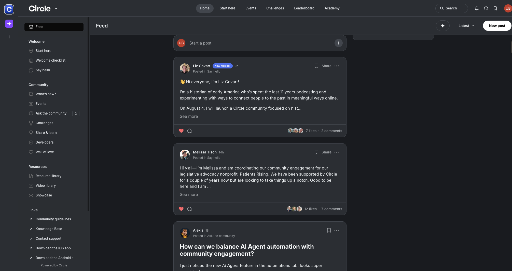
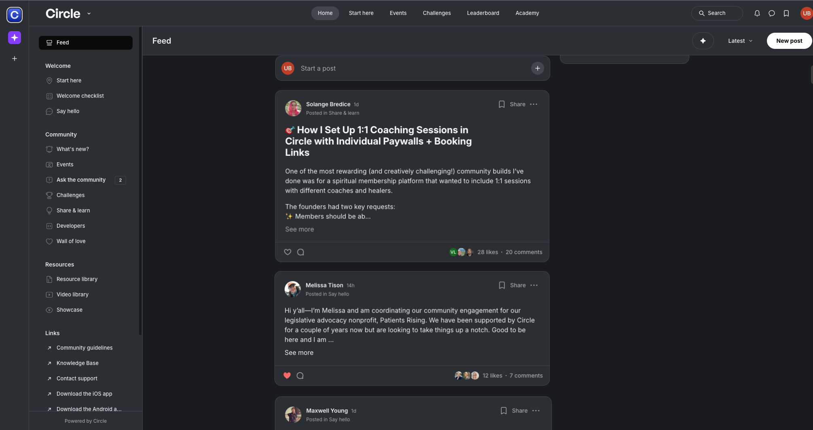

# Circle Feed Ranking Algorithm

## Project Goal
The goal is to build a ranking algorithm for Circle's feed to improve user engagement & user experience. The aim is to show users the most relevant, interesting, and fresh posts, rather than just the most recent.

## Folder Structure
```
circle-ranks/
  data/
    raw/           # Raw data fetched from the source
    processed/     # Cleaned and scored data
  notebooks/
    exploration.ipynb  # Data exploration and analysis
  scripts/
    fetching.py    # Fetches raw data
    processing.py  # Cleans and processes data
    scoring.py     # Assigns scores and ranks posts
  README.md
```

## Approach
1. **Data Fetching:**
   - used `scripts/fetching.py` to pull raw post data from the source.
2. **Data Processing:**
   - cleaned the data with `scripts/processing.py`.
3. **Exploration:**
   - explored the data in `notebooks/exploration.ipynb` to understand post engagement, recency, and other patterns.
4. **Scoring & Ranking:**
   - built the main ranking logic in `scripts/scoring.py`.

## Scoring Algorithm
- The initial idea was to combine likes, comments, and recency using weighted sums. But this led to old posts with huge engagement always showing up at the top, even if they were months old.
- To fix this, posts are split into age buckets:
  - 0-2 days
  - 3-5 days
  - 6-7 days
  - 8-14 days
  - 15-30 days
  - 31-90 days
  - \>90 days
- Posts are scored within each bucket using normalized likes, comments, and recency (with exponential decay). The top of the feed is always filled with the highest-scoring posts from the freshest buckets first, so recency is always prioritized.
- The output is a new, scored dataset of posts, ordered by score, ready to be used for the new feed.

## Feed UI: Before and After

| Before |
|--------|
|  |
| After |
|--------|
|  |

## Potential Improvements
- Add more features to the scoring model:
  - sum of likes on comments under each post
  - speed of getting likes (likes per hour, for example)
  - use NLP to analyze post content for quality or relevance
  - personalized ranking (e.g., based on user interests or past behavior)
  - downweight posts from the same author if they post too frequently
  - detect and boost trending posts (sudden engagement spikes)
- Try machine learning models for ranking instead of hand-tuned weights
- Add different types of scores (e.g., top_score, hot_score, personalized_score) for different feed types

## Integration
- In production, this would work directly with the main database, not just fetched data files.
- The scoring logic can be run as a batch job or in real-time, updating a `score` field (or multiple score fields) for each post.
- Multiple ranking algorithms can be implemented (e.g., "Top", "Hot", "New") and customers can choose which to offer to their community members as feed options.

## Testing & Evaluation
- To see if this new ranking actually improves engagement, we can run an A/B test by:
  - randomly assigning some users to the new ranking and others to the old one
  - tracking metrics like time spent in feed, number of posts viewed, likes, comments, and return visits
  - running the test for at least 2-4 weeks to get enough data
  - analyzing if the new ranking increases engagement, retention, or other key metrics
- We can also consider:
  - user surveys or feedback
  - monitoring for unintended side effects (e.g., important but less-engaged posts disappearing)